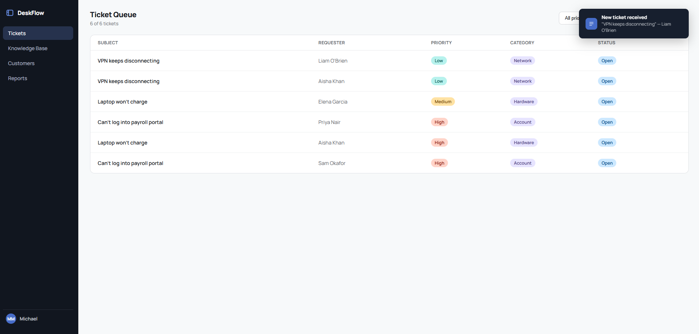
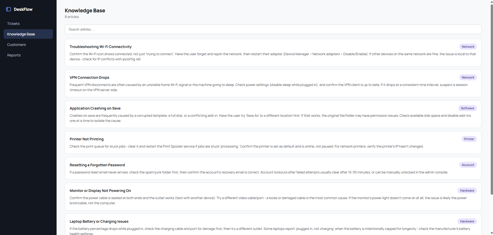
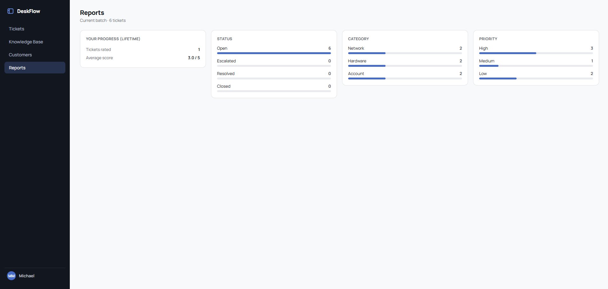

# DeskFlow — Help Desk Ticket Simulator

A practice tool for IT support work, built while studying for CompTIA A+.
Instead of just flashcards, DeskFlow lets you actually work simulated
help desk tickets — troubleshoot a problem, talk it through with an
AI-played customer, document your work, and get feedback on how you
handled it.





## Why I built this

I'm working toward an entry-level IT support role and wanted hands-on
practice with the actual day-to-day of the job — triaging tickets,
asking the right diagnostic questions, staying professional with a
frustrated (or vague, or non-technical) user, and documenting what I
did — not just studying terms for a certification exam. This project
also doubled as my first real project learning to code, paired with an
AI assistant that explained concepts along the way rather than writing
the whole thing for me.

## What it does

- **Ticket queue** — a dense, real-tool-style table of open tickets
  (subject, requester, priority, category, status), with filters by
  priority/category. New tickets also arrive on their own every so
  often while the app is open, with a toast notification — so the queue
  behaves a bit like a live one.
- **AI-simulated customer chat** — click into a ticket and talk to an
  AI playing that ticket's customer. Some customers describe their
  problem clearly; some are vague and need to be drawn out with good
  questions — you don't know which going in.
- **Internal notes** — log troubleshooting notes inline in the
  conversation (toggle between "Reply" and "Internal Note"), the same
  way real help desk tools separate customer-facing replies from
  private documentation.
- **Resolve, Close, or Escalate** — three realistic outcomes for a
  ticket, each reflected as a status badge in the queue.
- **AI feedback + scoring** — resolving a ticket gets you a short,
  honest critique of how you handled it (diagnosis, questions asked,
  professionalism) plus a 1-5 score, so you can tell if you're actually
  improving, not just going through the motions.
- **Reports page** — breakdowns of the current batch of tickets by
  status/category/priority, plus your lifetime average score across
  every ticket you've ever been rated on.
- **Knowledge Base** — a handful of searchable troubleshooting articles
  for common issues, to practice referencing documentation instead of
  working from memory alone.
- **Saved progress** — tickets, conversations, and your lifetime score
  history persist across reloads. A "New Batch" button resets the
  current queue for a fresh round of practice without losing your
  tracked progress.

## Tech stack

- **Frontend**: React + Vite, plain CSS
- **Backend**: Node.js + Express, talks to the Claude API (Haiku 4.5)
  so the API key never touches the browser
- No database — ticket data is randomly generated client-side; progress
  is saved via the browser's `localStorage`

## Running it locally

You'll need an Anthropic API key (console.anthropic.com) to run the
chat/feedback features.

```bash
# Frontend
npm install
npm run dev

# Backend (separate terminal)
cd server
npm install
cp .env.example .env   # then add your real ANTHROPIC_API_KEY
node index.js
```

Open the URL Vite prints (usually `http://localhost:5173`).

## What I learned

Going in, I barely knew JavaScript. Building this taught me the core
React patterns (components, props, state, lifting state up), how a
frontend safely talks to an AI API through a small backend instead of
exposing a key in the browser, and — just as usefully — a lot of the
actual IT support thinking this project set out to practice: asking
better diagnostic questions, knowing when to escalate instead of
guessing, and documenting as you go.

See [ROADMAP.md](ROADMAP.md) for the full build history and what's
planned next.
